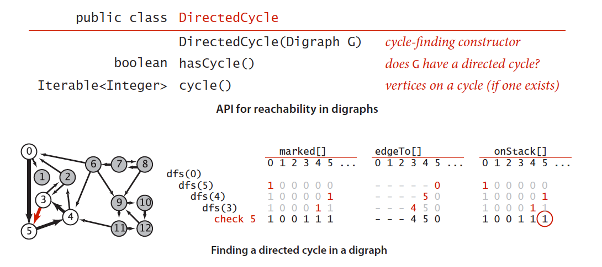

### 4.2 有向图

#### 4.2.1 术语定义


#### 4.2.2 有向图的数据类型

**API：**


方法`adj()`允许代码迭代从给定顶点相邻的顶点。

**数据表示：**


我们使用邻接列表表示，其中我们定义由边连接到每个顶点的顶点列表的顶点索引数组。


**代码实现：**

```java
public class Digraph {
    private static final String NEWLINE = System.getProperty("line.separator");

    private final int V;           // number of vertices in this digraph
    private int E;                 // number of edges in this digraph
    private Bag<Integer>[] adj;    // adj[v] = adjacency list for vertex v
    private int[] indegree;        // indegree[v] = indegree of vertex v
    
    public Digraph(int V) {
        if (V < 0) throw new IllegalArgumentException("Number of vertices in a Digraph must be nonnegative");
        this.V = V;
        this.E = 0;
        indegree = new int[V];
        adj = (Bag<Integer>[]) new Bag[V];
        for (int v = 0; v < V; v++) {
            adj[v] = new Bag<Integer>();
        }
    }

    public void addEdge(int v, int w) {
        validateVertex(v);
        validateVertex(w);
        adj[v].add(w);
        indegree[w]++;
        E++;
    }

    public Digraph reverse() {
        Digraph reverse = new Digraph(V);
        for (int v = 0; v < V; v++) {
            for (int w : adj(v)) {
                reverse.addEdge(w, v);
            }
        }
        return reverse;
    }
}

```

完整代码：[Digraph.java](https://algs4.cs.princeton.edu/42digraph/Digraph.java.html)

#### 4.2.3 有向图的可达性

- 单点可达性：给定有向图和源 s ，是否存在从s到v的有向路径？ 如果是这样，找到这样的路径。 [DirectedDFS.java](https://algs4.cs.princeton.edu/42digraph/DirectedDFS.java.html)  使用深度优先搜索来解决此问题。

  ```java
  public class DirectedDFS {
      private boolean[] marked;  // marked[v] = true iff v is reachable from source(s)
      private int count;         // number of vertices reachable from source(s)
      
      public DirectedDFS(Digraph G, int s) {
          marked = new boolean[G.V()];
          validateVertex(s);
          dfs(G, s);
      }
  
      public DirectedDFS(Digraph G, Iterable<Integer> sources) {
          marked = new boolean[G.V()];
          validateVertices(sources);
          for (int v : sources) {
              if (!marked[v]) dfs(G, v);
          }
      }
  
      private void dfs(Digraph G, int v) { 
          count++;
          marked[v] = true;
          for (int w : G.adj(v)) {
              if (!marked[w]) dfs(G, w);
          }
      }
  
      public boolean marked(int v) {
          validateVertex(v);
          return marked[v];
      }
  
      public static void main(String[] args) {
  
          // read in digraph from command-line argument
          In in = new In(args[0]);
          Digraph G = new Digraph(in);
  
          // read in sources from command-line arguments
          Bag<Integer> sources = new Bag<Integer>();
          for (int i = 1; i < args.length; i++) {
              int s = Integer.parseInt(args[i]);
              sources.add(s);
          }
  
          // multiple-source reachability
          DirectedDFS dfs = new DirectedDFS(G, sources);
  
          // print out vertices reachable from sources
          for (int v = 0; v < G.V(); v++) {
              if (dfs.marked(v)) StdOut.print(v + " ");
          }
          StdOut.println();
      }
  }
  ```

  

- 多点可达性：给定有向图和一组源顶点，是否存在从集合中的任何顶点到v的有向路径？ [DepthFirstDirectedPaths.java](https://algs4.cs.princeton.edu/42digraph/DepthFirstDirectedPaths.java.html) 使用深度优先搜索来解决此问题。

  可用于 java 程序中的 标记 - 清除的垃圾收集算法。标记－清除的垃圾回收策略会对每个对象保留一个位做垃圾收集之用。它会**周期性地运行一个类似于 DirectedDFS 的有向图可达性算法**来标记所有**可以被访问到**的对象，然后清理所有对象，回收**没有被标记**的对象，以腾出内存供新的对象使用。

- 单点有向路径：给定有向图和源 s，是否存在从 s 到 v 的有向路径？ 如果是这样，找到这样的路径。  [DepthFirstDirectedPaths.java](https://algs4.cs.princeton.edu/42digraph/DepthFirstDirectedPaths.java.html) 使用深度优先搜索来解决此问题。

- 单点最短有向路径：给定有向图和源 s，是否存在从 s 到 v 的有向路径？ 如果是这样，找到最短的路径。 [BreadthFirstDirectedPaths.java](https://algs4.cs.princeton.edu/42digraph/BreadthFirstDirectedPaths.java.html) 使用广度优先搜索来解决此问题。

#### 4.2.4 环和有向无环图

有向环在涉及处理有向图的应用程序中特别重要。

- 判断有向图中是否有坏？有向环检测：给定的有向图是否有有向环？ 如果是这样，找到这样一个循环。 [DirectedCycle.java](https://algs4.cs.princeton.edu/42digraph/DirectedCycle.java.html) 使用深度优先搜索解决了这个问题。 

  

  ```java
  public class DirectedCycle {
      private boolean[] marked;        // marked[v] = has vertex v been marked?
      private int[] edgeTo;            // edgeTo[v] = previous vertex on path to v
      private boolean[] onStack;       // onStack[v] = is vertex on the stack?
      private Stack<Integer> cycle;    // directed cycle (or null if no such cycle)
  
      public DirectedCycle(Digraph G) {
          marked  = new boolean[G.V()];
          onStack = new boolean[G.V()];
          edgeTo  = new int[G.V()];
          for (int v = 0; v < G.V(); v++)
              if (!marked[v] && cycle == null) dfs(G, v);
      }
  
      private void dfs(Digraph G, int v) {
          onStack[v] = true;
          marked[v] = true;
          for (int w : G.adj(v)) {
  
              // short circuit if directed cycle found
              if (cycle != null) return;
  
              // found new vertex, so recur
              else if (!marked[w]) {
                  edgeTo[w] = v;
                  dfs(G, w);
              }
  
              // trace back directed cycle
              else if (onStack[w]) {
                  cycle = new Stack<Integer>();
                  for (int x = v; x != w; x = edgeTo[x]) {
                      cycle.push(x);
                  }
                  cycle.push(w);
                  cycle.push(v);
                  assert check();
              }
          }
          onStack[v] = false;
      }
  }
  ```

- 顶点的深度优先次序与拓扑排序

  深度优先搜索搜索只访问每个顶点一次。 典型应用中顶点的三种排列顺序：

  - 前序：在递归调用之前将顶点加入队列。
  - 后序：在递归调用之后将顶点加入队列。
  - **逆后序**：在递归调用之**后**将顶点压入**栈**。

  

  

  ```java
  public class DepthFirstOrder {
      private boolean[] marked;          // marked[v] = has v been marked in dfs?
      private int[] pre;                 // pre[v]    = preorder  number of v
      private int[] post;                // post[v]   = postorder number of v
      private Queue<Integer> preorder;   // vertices in preorder
      private Queue<Integer> postorder;  // vertices in postorder
      private int preCounter;            // counter or preorder numbering
      private int postCounter;           // counter for postorder numbering
  
      public DepthFirstOrder(Digraph G) {
          pre    = new int[G.V()];
          post   = new int[G.V()];
          postorder = new Queue<Integer>();
          preorder  = new Queue<Integer>();
          marked    = new boolean[G.V()];
          for (int v = 0; v < G.V(); v++)
              if (!marked[v]) dfs(G, v);
  
          assert check();
      }
  
      public DepthFirstOrder(EdgeWeightedDigraph G) {
          pre    = new int[G.V()];
          post   = new int[G.V()];
          postorder = new Queue<Integer>();
          preorder  = new Queue<Integer>();
          marked    = new boolean[G.V()];
          for (int v = 0; v < G.V(); v++)
              if (!marked[v]) dfs(G, v);
      }
  
      private void dfs(Digraph G, int v) {
          marked[v] = true;
          pre[v] = preCounter++;
          preorder.enqueue(v);
          for (int w : G.adj(v)) {
              if (!marked[w]) {
                  dfs(G, w);
              }
          }
          postorder.enqueue(v);
          post[v] = postCounter++;
      }
  
      private void dfs(EdgeWeightedDigraph G, int v) {
          marked[v] = true;
          pre[v] = preCounter++;
          preorder.enqueue(v);
          for (DirectedEdge e : G.adj(v)) {
              int w = e.to();
              if (!marked[w]) {
                  dfs(G, w);
              }
          }
          postorder.enqueue(v);
          post[v] = postCounter++;
      }
  
      public int pre(int v) {
          validateVertex(v);
          return pre[v];
      }
  
      public int post(int v) {
          validateVertex(v);
          return post[v];
      }
  
      public Iterable<Integer> post() {
          return postorder;
      }
  
      public Iterable<Integer> pre() {
          return preorder;
      }
  
      public Iterable<Integer> reversePost() {
          Stack<Integer> reverse = new Stack<Integer>();
          for (int v : postorder)
              reverse.push(v);
          return reverse;
      }
  }
  ```

  完整代码：[DepthFirstOrder.java](https://algs4.cs.princeton.edu/42digraph/DepthFirstOrder.java.html)

- 拓扑排序

  - 当且仅当一幅有向图是无环图时才能进行拓扑排序。
  - 一幅有向无环图的拓扑顺序即为所有顶点的**逆后序排列**（证明见 p376）。

  ```java
  public class Topological {
      private Iterable<Integer> order;  // topological order
      private int[] rank;               // rank[v] = rank of vertex v in order
  
      public Topological(Digraph G) {
          DirectedCycle finder = new DirectedCycle(G);
          if (!finder.hasCycle()) {
              DepthFirstOrder dfs = new DepthFirstOrder(G);
              order = dfs.reversePost();
              rank = new int[G.V()];
              int i = 0;
              for (int v : order)
                  rank[v] = i++;
          }
      }
  
      public Topological(EdgeWeightedDigraph G) {
          EdgeWeightedDirectedCycle finder = new EdgeWeightedDirectedCycle(G);
          if (!finder.hasCycle()) {
              DepthFirstOrder dfs = new DepthFirstOrder(G);
              order = dfs.reversePost();
          }
      }
  
      public Iterable<Integer> order() {
          return order;
      }
  
      public static void main(String[] args) {
          String filename  = args[0];
          String delimiter = args[1];
          SymbolDigraph sg = new SymbolDigraph(filename, delimiter);
          Topological topological = new Topological(sg.digraph());
          for (int v : topological.order()) {
              StdOut.println(sg.nameOf(v));
          }
      }
  
  }
  ```

  完整代码： [Topological.java](https://algs4.cs.princeton.edu/42digraph/Topological.java.html)

##### 


