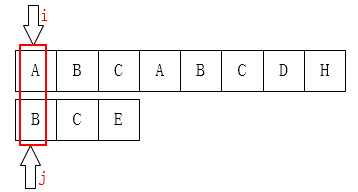
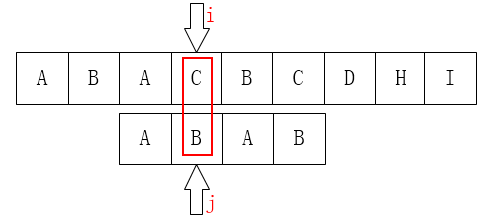

## 5.3 子字符串查找

- 问题描述：给定一段长度为 N 的文本和一个长度为 M 的**模式（pattern）**字符串，在文本中找到一个和该模式相符的子字符串。
- 限制：模式相对文本较短（M 可能等于 100 或者 1000），而文本相对模式很长（N 可能等于 100 万或者 10 亿）。

### 5.3.1 历史

### 5.3.2 暴力子字符串查找算法

在最坏情况下运行时间与 MN 成正比；但由于绝大多数比较在第一个字符时就会产生不匹配，实际运行时间一般与 M+N 成正比。

```java
public static int search(String pat, String txt) {
    int M = pat.length();
    int N = txt.length();
    for(int i = 0; i <= N-M; i++) {
        int j;
        for(j = 0; j < M; j++)
            if(txt.charAt(j+i) != pat.charAt(j))
                break;
        if(j == M)
            return i;    // 找到匹配
    }
    return N;    // 未找到匹配
}
```


**最坏的情况下：**


另一种实现：

```java
public static int search(String pat, String txt) {
    int M = pat.length();
    int N = txt.length();
    int i, j;
    for(i = 0, j = 0; i < N && j < M; i++) {
        if(txt.charAt(i) == pat.charAt(j))
            j++;
        else {
            i -= j;
            j = 0;
        }
    }
    if(j == M)
        return i - M;    // 找到匹配
    else
        return N;    // 未找到匹配
}
```

### 5.3.3 Knuth-Morris-Pratt(KMP) 子字符串查找算法

基本思想：在匹配失败之前，一部分文本的内容已经和模式相匹配。因此不该完全从头开始匹配。

设置：

- 文本指针 i，模式指针 j

  

  如图：C和D不匹配了，我们要把j移动到哪？显然是第1位。为什么？因为前面有一个A相同啊：

  

  如书中实例：

  

  检索到 B 之后，i 不动，j 移动到模式字符串 0 处。

  至此我们可以大概看出一点端倪，当匹配失败时，j 要移动的下一个位置 k。存在着这样的性质：**最前面的 k 个字符和 j 之前的最后 k 个字符是一样的**。

  如果用数学公式来表示是这样的：P[0 ~ k-1] == P[j-k ~ j-1]

  

  弄明白了这个就应该可能明白为什么可以直接将j移动到k位置了。

  因为:

  **当T[i] != P[j]时**

  **有T[i-j ~ i-1] == P[0 ~ j-1]**

  **由P[0 ~ k-1] == P[j-k ~ j-1]**

  **必然：T[i-k ~ i-1] == P[0 ~ k-1]**

  

  好，接下来就是重点了，怎么求这个（这些）k呢？因为在 P 的每一个位置都可能发生不匹配，也就是说我们要计算每一个位置 j 对应的 k，所以用一个数组 next 来保存，**next[j] = k**，表示当T[i] != P[j]时，j 指针的下一个位置。

- 数组 next[][]：记录匹配失败时模式指针 j 指针的下一个位置。

  ```java
  public static int[] getNext(String ps) {
  
      char[] p = ps.toCharArray();
      int[] next = new int[p.length];
      next[0] = -1;
      int j = 0;
      int k = -1;
  
      while (j < p.length - 1) {
         if (k == -1 || p[j] == p[k]) {
             next[++j] = ++k;
         } else {
             k = next[k];
         }
      }
      return next;
  }
  ```

  这个版本的求next数组的算法应该是流传最广泛的，代码是很简洁。可是真的很让人摸不到头脑，它这样计算的依据到底是什么？

  好，先把这个放一边，我们自己来推导思路，现在要始终记住一点，**next[j]的值（也就是k）表示，当P[j] != T[i]时，j指针的下一步移动位置。**

  先来看第一个：当 j 为0时，如果这时候不匹配，怎么办？

  

  像上图这种情况，**j 已经在最左边了，不可能再移动了，这时候要应该是 i 指针后移**。所以在代码中才会有next[0] = -1;这个初始化。

  如果是当j为1的时候呢？

  

  显然，**j 指针一定是后移到 0 位置的**。因为它前面也就只有这一个位置了~~~

  下面这个是最重要的，请看如下图：

  

  

  请仔细对比这两个图。

  我们发现一个规律：

  ​	**当P[k] == P[j]时，**

  **​	有next[j+1] == next[j] + 1**

  其实这个是可以证明的：

  ​	**因为在P[j]之前已经有P[0 ~ k-1] == p[j-k ~ j-1]。（next[j] == k）**

  **​	这时候现有P[k] == P[j]，我们是不是可以得到P[0 ~ k-1] + P[k] == p[j-k ~ j-1] + P[j]。**

  **​	即：P[0 ~ k] == P[j-k ~ j]，即next[j+1] == k + 1 == next[j] + 1。**

  这里的公式不是很好懂，还是看图会容易理解些。

  那如果P[k] != P[j]呢？比如下图所示：

  

  像这种情况，如果你从代码上看应该是这一句：k = next[k];为什么是这样子？你看下面应该就明白了。

  

  现在你应该知道为什么要k = next[k]了吧！像上边的例子，我们已经不可能找到[ A，B，A，B ]这个最长的后缀串了，但我们还是可能找到[ A，B ]、[ B ]这样的前缀串的。所以这个过程像不像在定位[ A，B，A，C ]这个串，当C和主串不一样了（也就是k位置不一样了），那当然是把指针移动到next[k]啦。

  有了next数组之后就一切好办了，我们可以动手写KMP算法了：

  ```java
  public static int KMP(String ts, String ps) {
  
      char[] t = ts.toCharArray();
  
      char[] p = ps.toCharArray();
  
      int i = 0; // 主串的位置
  
      int j = 0; // 模式串的位置
  
      int[] next = getNext(ps);
  
      while (i < t.length && j < p.length) {
  
         if (j == -1 || t[i] == p[j]) { // 当j为-1时，要移动的是i，当然j也要归0
             i++;
             j++;
         } else {
             // i不需要回溯了
             // i = i - j + 1;
             j = next[j]; // j回到指定位置
         }
      }
  
      if (j == p.length) {
         return i - j;
      } else {
         return -1;
      }
  }
  ```

  最后，来看一下上边的算法存在的缺陷。来看第一个例子：

  

  显然，当我们上边的算法得到的next数组应该是[ -1，0，0，1 ]

  所以下一步我们应该是把j移动到第1个元素咯：

  

  不难发现，**这一步是完全没有意义的。因为后面的B已经不匹配了，那前面的B也一定是不匹配的**，同样的情况其实还发生在第2个元素A上。显然，**发生问题的原因在于P[j] == P[next[j]]**。

  所以我们也只需要添加一个判断条件即可：

  ```java
  public static int[] getNext(String ps) {
  
      char[] p = ps.toCharArray();
      int[] next = new int[p.length];
      next[0] = -1;
      int j = 0;
      int k = -1;
  
      while (j < p.length - 1) {
         if (k == -1 || p[j] == p[k]) {
             if (p[++j] == p[++k]) { // 当两个字符相等时要跳过
                next[j] = next[k];
             } else {
                next[j] = k;
             }
         } else {
             k = next[k];
         }
      }
      return next;
  }
  ```

  KMP 算法讲解转载自：https://www.cnblogs.com/yjiyjige/p/3263858.html#commentform

### 5.3.4 Boyer-Moore 字符串查找算法

### 5.3.5 Rabin-Karp 指纹字符串查找算法

